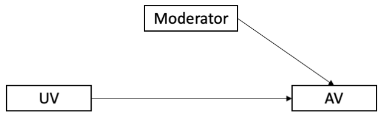

```{r setup, include=FALSE}
options(htmltools.dir.version = FALSE)

setwd("/Users/stephangoerigk/Desktop/Universität/CFH/Lehre/Bachelor/Empirisch-wissenschaftliches Arbeiten/VO_Wissenschaftliches Arbeiten und Forschungsmethoden/Folien/")

library(tidyverse)
library(kableExtra)
library(ggplot2)
library(plotly)
library(htmlwidgets)
library(MASS)
library(ggpubr)
library(xaringanthemer)
library(xaringanExtra)

style_duo_accent(
  primary_color = "#621C37",
  secondary_color = "#EE0071",
  background_image = "blank.png"
)

xaringanExtra::use_xaringan_extra(c("tile_view"))

# use_scribble(
#   pen_color = "#EE0071",
#   pen_size = 4
#   )

knitr::opts_chunk$set(
  fig.retina = TRUE,
  warning = FALSE,
  message = FALSE
)
```

name: Title slide
class: middle, left
<br><br><br><br><br><br><br>
# Wissenschaftliches Arbeiten und Forschungsmethoden

### Einheit 1
##### 12.10.2022 | Dr. Stephan Goerigk

---
class: top, left
name: Contact Slide

### Kontakt

.pull-left[
Dr. Stephan Goerigk 

Psychologische Methodenlehre

Infanteriestraße 11a · 80797 München · Raum: xxx

[stephan.goerigk@charlotte-fresenius.de](mailto:stephan.goerigk@charlotte-fresenius.de)

Zoom Sprechstunde (bitte per Email anmelden): 

Meeting-ID: 284 567 8838

Kenncode: 807174

[Publikationen](https://scholar.google.at/citations?user=nlvO-e4AAAAJ&hl=de)

[Commitment to Research Transparency](http://www.researchtransparency.org)
]

.pull-right[
.center[
<br><br><br>
.bottom[]
]
]

---
class: top, left
### Übersicht Lehrveranstaltung 

Termine:
* 14 Termine
* Donnerstag 11:35 - 13:05 (Raum: A_3.10)

Begleitendes Seminar:
* Übung zur Computergestützten Datenanalyse
* 14 Termine
* Donnerstag 13:50 - 15:20 (Raum: A_1.11)

Materialien:
* werden auf [Studynet](https://studynet.hs-fresenius.de/ilias.php?ref_id=15268&cmd=view&cmdClass=ilobjgroupgui&cmdNode=xa:o1&baseClass=ilRepositoryGUI) bereitgestellt

Interaktion während der Lehrveranstaltung:
* [Note-Pad](https://docs.google.com/document/d/1dnTL3c64X8Z9hgiLzWk-SrjS0QJodd1TMauePhHf7dk/edit) 

Prüfungsleistung:
* Projektbericht als Gruppenarbeit (max. 5 Studierende)
* Umfang: 5-7 Seiten p.P.
* Anmeldezeitraum: 10.10. - 31.10.2022; Abgabe: 06.02.2023

---
class: top, left
### Termine

```{r echo = F}
df = readxl::read_xlsx("Wissenschaftliches Arbeiten und Forschungsmethoden_Termine.xlsx", sheet = "Tabelle1")[, 1:3]
df$Datum = format(as.Date(df$Datum), "%d.%m.%Y")
df %>%
  kbl() %>%
  kable_classic(full_width = T, position = "left")
```

---
class: top, left
### Inhalte und Ziele der Psychologie

#### Definitionen

.center[
Frage:

„Womit befasst sich die Psychologie?“

Wissenschaftlich ausgedrückt: 

„Was ist der Gegenstand der Psychologie?“
]

Definition:

Gegenstand der Psychologie sind 
* **Verhalten**
* **Erleben**  
* **Bewusstsein** des Menschen
* deren Entwicklung über die Lebensspanne 
* und deren innere (im Individuum angesiedelte) Bedingungen und Ursachen 
* und äußere (in der Umwelt lokalisierte) Bedingungen und Ursachen.

---
class: top, left
### Inhalte und Ziele der Psychologie

#### Verhalten, Erleben und Bewusstsein

Menschliches Verhalten ist ohne mentale Prozesse (Erleben und Bewusstsein) nicht verständlich.

Beschreibungsebenen: behavioral, emotional, kognitiv, (physiologisch)

.pull-left[
<br>
]
.pull-right[

**SORK-Schema** der kognitiven Verhaltentherapie

**S:** Person drängelt an Supermarktkasse vor.

**O:** Meine Biographie, Einstellungen, Kompetenzen...

**R (k):** "Das war ja klar..", "Ich bin es nicht wert..."

**R (e):** Niedergeschlagenheit

**R (p):** Erröten, Knoten im Hals

**R (b):** Ich sage nichts, lasse es geschehen.

**K (-):** Ich werde übergangen. **K (+):** Kein Konflikt
]

---
class: top, left
### Inhalte und Ziele der Psychologie

.pull-left[
**Erleben & Bewusstsein**
.center[
$\downarrow$
Innere Erfahrung von Gedanken, Gefühlen, Wünschen

$\downarrow$

Nicht direkt beobachtbar, Auskünfte der Person sind zentrale Quelle

$\downarrow$

Gew. Verhaltensweisen lassen zwar auf best. Gefühle schließen, aber nicht zwingend

$\downarrow$

Vom Verhalten kann nicht direkt auf das Erleben geschlossen werden
]
]
.pull-right[
.center[
**Verhalten**

$\downarrow$

Komplexe Handlungen und Verhaltensweisen ebenso wie einfache Äußerungen (z.B. Gestik, Atmung)

$\downarrow$

der Beobachtung von Außen zugänglich
]
]

---
class: top, left
### Inhalte und Ziele der Psychologie

#### Ziele der Psychologie

**1. Beschreibung** 

präzises und systematisches Erfassen von Informationen/Daten bzgl. Erleben und Verhalten

**2. Erklärung** 

Interpretation dieser Daten anhand von Hypothesen, Theorien z.B. hinsichtlich ihrer Kausalzusammenhänge

**3. Vorhersage** 

aus belegten Modellen/Theorien Vorhersagen über Verhalten ableiten

**4. Kontrolle** 

Erleben und Verhalten aufgrund der Erkenntnisse gezielt beeinflussen

---
class: top, left
### Inhalte und Ziele der Psychologie

#### Ziele der Psychologie

Beispiel Freundschaftsmuster in multikulturellen Schulklassen

**1. Beschreibung** 

Erhebung von Herkunftsland, FreundInnen (+ Herkunftsland)

**2. Erklärung** 

Homophily Hypothese = Freundschaften basieren auf Ähnlichkeiten; zusätzlich: Opportunitätsstrukturen

**3. Vorhersage** 

in Schule mehr interkulturelle Freundschaften als außerhalb Schule

**4. Kontrolle** 

Program WiSK zur Förderung von sozialer und interkultureller Kompetenz

---
class: top, left
### Inhalte und Ziele der Psychologie

<br><br><br><br><br><br>
.center[
„*Es ist in jeder Hinsicht ein sehr schwieriges Unterfangen, sich über die Seele eine feste Meinung zu bilden.*“

**Aristoteles**
]

---
class: top, left
### Was bedeutet „empirisch“?

* empirisch (griech.) = auf Erfahrung beruhend

* Empirische Forschung sucht nach Erkenntnissen durch systematische Auswertung von Erfahrungen (Bortz & Döring, 2002)

* Empirisch oder evidenzbasiert sind alle wissenschaftlichen Erkenntnisse, die auf Erfahrungen aufbauen

* Erkenntnisse basieren auf systematischer Datenerhebung und Datenauswertung

* Empirische Wissenschaft: Fokus ist, menschliche Erfahrung zu systematisieren und methodisch vor Irrtum zu sichern (Walach, 2005)

---
class: top, left
### Variablen und Daten

---
class: top, left
### Alltagsvermutungen und wissenschaftliche Hypothesen

#### Was sind Hypothesen?

Hypothese (griech.) = Unterstellung, Vermutung

Eine Vermutung/Annahme ist dann als wissenschaftliche Hypothese zu verstehen wenn sie folgende 4 Kriterien erfüllt:

Wenn sie...
1. ...sich auf reale Sachverhalte bezieht, die empirisch untersuchbar sind. (**Empirie**)

2. ...allgemein gültig ist und über den Einzelfall bzw. ein singuläres Ereignis hinausgeht (**All-Satz**)

3. ...zumindest implizit die Form eines Konditionalsatzes hat (**wenn-dann, je-desto**)

4. ...durch Erfahrungen potenziell widerlegbar ist (**Falsifizierbarkeit**)

5. ...(theoretisch begründbar ist)

---
class: top, left
### Alltagsvermutungen und wissenschaftliche Hypothesen

.pull-left[
#### Beispiele für Hypothesen:

* Frauen sind kreativer als Männer

* Mit zunehmender Müdigkeit sinkt die Konzentrationsfähigkeit

* Je schöner das Wetter, desto besser die Stimmung

* Buben und Mädchen lesen unterschiedlich viel in ihrer Freizeit

Behauptungen erfüllen alle genannten Kriterien: sind daher Hypothesen
]

.pull-right[
```{r eval = TRUE, echo = F, out.width = "300px"}
knitr::include_graphics("bilder/obelix.png")
```
]

---
class: top, left
### Alltagsvermutungen und wissenschaftliche Hypothesen

#### Hypothesen: JA oder NEIN?

* Bei starkem Zigarettenkonsum kann es zu Herzinfarkt kommen

* Wenn es regnet, kann die Sonne scheinen.

* Es gibt Kinder, die niemals weinen.

* SchülerInnen aus Gymansien zeigen gute Leistungen

---
class: top, left
### Alltagsvermutungen und wissenschaftliche Hypothesen

#### Hypothesen: JA oder NEIN?

* Bei starkem Zigarettenkonsum kann es zu Herzinfarkt kommen

$\rightarrow$ Kann-Sätze sind nicht falsifizierbar

* Wenn es regnet, kann die Sonne scheinen.

$\rightarrow$ Kann-Sätze sind nicht falsifizierbar

* Es gibt Kinder, die niemals weinen.

$\rightarrow$ kein All-Satz, nicht falsifizierbar

* SchülerInnen aus Gymansien zeigen gute Leistungen

$\rightarrow$ Wenn-dann Struktur nicht gegeben, daher nicht
falsifizierbar

---
class: top, left
### Alltagsvermutungen und wissenschaftliche Hypothesen

#### Hypothesen: JA oder NEIN?

* Die Konzentrationsfähigkeit hängt mit der Blutalkoholkonzentration zusammen.

* Positive Verstärkung durch Lehrer/innen kann zu guten Leistungen bei Schüler/innen führen.

* Positives Feedback beeinflusst die Arbeitsleistung.

* Viele Studierende mögen Methodenlehrveranstaltungen.

---
class: top, left
### Alltagsvermutungen und wissenschaftliche Hypothesen

#### Hypothesen: JA oder NEIN?

* Die Konzentrationsfähigkeit hängt mit der Blutalkoholkonzentration zusammen.

$\rightarrow$ JA

* Positive Verstärkung durch Lehrer/innen kann zu guten Leistungen bei Schüler/innen führen.

$\rightarrow$ NEIN

* Positives Feedback beeinflusst die Arbeitsleistung.

$\rightarrow$ JA

* Viele Studierende mögen Methodenlehrveranstaltungen.

$\rightarrow$ NEIN

---
class: top, left
### Alltagsvermutungen und wissenschaftliche Hypothesen

#### Richtung von Hypothesen

Je nach Erkenntnisstand kann eine ungerichtete oder eine gerichtete Hypothese formuliert werden.

**ungerichtete Hypothese:**

Die Konzentrationsfähigkeit hängt mit der Blutalkoholkonzentration zusammen.

$\rightarrow$ Eher wenig theoretisches Vorwissen.

**gerichtete Hypothese:**

Je höher die Blutalkoholkonzentration, desto niedriger die Konzentrationsfähigkeit.

$\rightarrow$ Mehr theoretisches Vorwissen notwendig.

---
class: top, left
### Alltagsvermutungen und wissenschaftliche Hypothesen

#### Verifikation und Falsifikation


.pull-left[
##### Verifikation

* Wissenschaftliche Hypothesen in der Psychologie können nicht vollständig geprüft (**verifiziert**) werden.

* Es ist nicht möglich alle Fälle (**Population**) zu untersuchen, schon gar nicht für alle Zeiten.

**Workaround:**

* Untersuchungen erfolgen anhand **repräsentativer Stichprobe**, von der auf Population geschlossen wird.


$\rightarrow$ Wissenschaftliche Hypothesen sind **Wahrscheinlichkeitsaussagen**!
]

.pull-right[
```{r eval = TRUE, echo = F, out.width = "500px"}
knitr::include_graphics("bilder/Population.png")
```
]
---
class: top, left
### Alltagsvermutungen und wissenschaftliche Hypothesen

#### Verifikation und Falsifikation

##### Falsifikation

* Wissenschaftliche Hypothesen können nicht durch Einzelfälle/Gegenbeispiele, die der Hypothese widersprechen, widerlegt werden (**falsifiziert**).

* Der auf dem Falsifikationsprinzip basierende Erkenntnisfortschritt besteht in der Eliminierung falscher bzw. schlecht bewährter Hypothesen (Theorien).

* Nicht falsifizierte Hypothesen (Theorien) sind nicht wahr, sondern gelten nur als vorläufig angenommen.

* Konträre Einzelfälle sind explizit zugelassen

.center[
```{r eval = TRUE, echo = F, out.width = "200px"}
knitr::include_graphics("bilder/blackswan.jpg")
```
]
---
class: top, left
### Alltagsvermutungen und wissenschaftliche Hypothesen

#### Theorien und Hypothesen

<br><br>

.center[
.content-box-gray[**Satzsysteme:** Theorien, Modelle, Gesetze]

$\downarrow$ $\uparrow$

.content-box-gray[**Einzelsätze:** Hypothesen = prüfbare Behauptungen über empirisch beobachtbare Sachverhalte]

$\downarrow$ $\uparrow$

.content-box-gray[**Realität:** Bereich der empirisch beobachtbaren Phänomene]
]

<br><br>
Grundkonzeption empirischer Wissenschaften Empirische Prüfbarkeit ihrer Sätze (Dörner & Selg, 1984)

---
class: top, left
### Operationalisierung

Human- und Sozialwissenschaften untersuchen häufig Konstrukte (= latente Merkmale = latente Variablen):
• Psychisches oder soziales Phänomene, das nicht unmittelbar beobachtbar (manifest) ist
• Muss aus (manifesten) Indikatoren erschlossen werden (z.B. Gesichtsausdruck – Emotion)
• Operationalisierung muss auf Basis theoretischer Überlegungen (Theorien, Modellen) erfolgen

---
class: top, left
### Operationalisierung

• Operationalisierung = das „messbar Machen“ von Merkmalen
• Übersetzen der Hypothesenbestandteile in messbare Größen
• Grundsätzlich kann jedes interessierende Merkmal auf
ganz unterschiedliche Weise operationalisiert werden
􏰇Was heißt „Messen“ in der Psychologie?
• Zuordnung von Zahlen zu Objekten nach festen Regeln
• In der Relation der Messwerte muss sich die Relation der gemessenen Objekte widerspiegeln

---
class: top, left
### Operationalisierung

#### Beispiel: „Messung“ von Intelligenz

* Intelligenz nicht direkt beobachtbar (latente Variable, Konstrukt)

* Verschiedene Theorien zur Struktur der Intelligenz

* Intelligenz wird gemessen über Ergebnis (Score) einer Person in einem Intelligenztest, der die Struktur des jeweiligen Modells abbildet

* D.h. von der Anzahl korrekt gelöster Aufgaben in einem solchen Intelligenztest wird auf die „dahinter liegende“Intelligenz (latentes Konstrukt) geschlossen

* Unterschiedlichen Ausprägungen von Intelligenz werden unterschiedliche Zahlen zugeordnet (Differenzen zwischen Zahlen sollen Unterschieden zwischen Personen entsprechen)

---
class: top, left
### Operationalisierung

#### Beispiel: „Messung“ von Intelligenz

.pull-left[
**Thurstone: Multiple-Faktoren-Theorie mit sieben Einzelfaktoren**

* Räumliches Vorstellungsvermögen (spatial ability) 
* Rechenfähigkeit (numerical ability)
* Sprachverständnis (verbal comprehension) 
* Wortflüssigkeit (word fluency)
* Gedächtnis (memory) 
* Wahrnehmungsgeschwindigkeit (perceptual speed) 
* Logisches Denken (reasoning)
]

.pull-right[
**Gardner: Theorie der multiplen Intelligenzen**

* Sprachlich-linguistische Intelligenz, 
* Logisch-mathematische Intelligenz 
* Musikalisch-rhythmische Intelligenz
* Bildlich-räumliche Intelligenz 
* Körperlich-kinästhetische Intelligenz
* Naturalistische Intelligenz 
* Interpersonale Intelligenz
* Intrapersonale Intelligenz
]

---
class: top, left
### Operationalisierung

Beispiel: „Messung“ von Angst
* Angst nicht direkt beobachtbar (latente Variable, Konstrukt)

* Verschiedene Theorien zu Bestandteilen der Angst

* Angst wird z.B. erhoben mittels Fragebogen, in dem eine Person sich bzgl. der Prüfungsangst einschätzt. -> Anzahl an Fragen, denen Person zustimmt (JA/ NEIN) oder Ausmaß der Zustimmung

* ODER: man lässt offen erzählen, im Interview

* ODER: man misst in Prüfungssituation physiolog. Parameter

Konkrete Operationalisierung hängt immer vom Kontext, den Ressourcen und der zugrundeliegenden Theorie ab

---
class: top, left
### Variablen

**Ziel empirischer Forschung:**

Registrierte Merkmalsunterschiede (= **Variabilität**) zu analysieren und zu erklären.

* **Variable** = Interessierendes Merkmal, das unterschiedliche Ausprägungen annehmen kann

* Beispiele für Variablen: 
  * Geschlecht
  * Lieblingsfarbe
  * Länge

* **Merkmalsausprägung** = konkrete Erscheinungsform einer Variable

* Beispiele für Merkmalsausprägungen: 
  * Geschlecht [männlich, weiblich, divers]
  * Lieblingsfarbe [rot, gelb, grün, blau]
  * Länge [1 cm, 1.5 cm, 3 cm,...]

---
class: top, left
### Variablen

#### Arten von Variablen

Variablen können anhand unterschiedlicher Eingeschaften unterteilt werden:

* nach Art der Merkmalsausprägungen

* nach empirischer Zugänglichkeit

* nach Stellenwert in der Untersuchung

---
class: top, left
### Variablen

Arten von Variablen – nach Art der Merkmalsausprägungen

* **stetig** (kontinuierlich): jedes Intervall besitzt unendlich viele Merkmalsausprägungen (z.B. Länge, Zeit, Masse)
  
* **diskret** (diskontinuierlich): Intervall mit endlich vielen Ausprägungen z.B. Geschlecht, Lieblingsfarbe

  * **dichotom** (binär) = 2 Abstufungen (0, 1) 
  * **polytom** = mehrfach gestuft
  * **konstant** = nur 1 Merkmalsausprägung
  
$\rightarrow$ Art der Variable bestimmt das statistische Verfahren (z.B. stetig $\rightarrow$ Regression, binär $\rightarrow$ logistische Regression)

.center[
```{r echo = F, fig.height=2,  fig.width=6, out.width = "700px"}
set.seed(123)
d = data.frame(x = rnorm(1:100000))
e = data.frame(x = rep(c(-1, 1), each = 12000)) 
f = data.frame(x = rep(c(0), each = 12000)) 

cowplot::plot_grid(
  ggplot(d, aes(x)) +
    geom_density() +
    labs(y = "", x = "stetig") +
    scale_x_continuous(limits = c(-3, 3), breaks = c(-3,-2,-1, 0, 1, 2 ,3)) +
    theme_classic() +
  theme(axis.text = element_blank(), axis.ticks = element_blank()),
  ggplot(d, aes(x)) +
    geom_histogram(fill = "black") +
    labs(y = "", x = "diskret (polytom)") +
    scale_x_continuous(limits = c(-3, 3), breaks = c(-3,-2,-1, 0, 1, 2 ,3)) +
    theme_classic() +
  theme(axis.text = element_blank(), axis.ticks = element_blank()),
   ggplot(e, aes(x)) +
    geom_histogram(fill = "black") +
    labs(y = "", x = "binär") +
    scale_x_continuous(limits = c(-3, 3), breaks = c(-3,-2,-1, 0, 1, 2 ,3)) +
    theme_classic() +
  theme(axis.text = element_blank(), axis.ticks = element_blank()),
  ggplot(f, aes(x)) +
    geom_histogram(fill = "black") +
    labs(y = "", x = "konstant") +
    scale_x_continuous(limits = c(-3, 3), breaks = c(-3,-2,-1, 0, 1, 2 ,3)) +
    theme_classic() +
  theme(axis.text = element_blank(), axis.ticks = element_blank()), ncol = 4)
```
]
---
class: top, left
### Variablen

Arten von Variablen – nach empirischer Zugänglichkeit

* **manifest** = direkt beobachtbar (Bsp. Raucher sein, Alter)

* **latent** = nicht unmittelbar beobachtbar; hypothetisches Konstrukt (Bsp. Intelligenz)


---
class: top, left
### Variablen

Arten von Variablen – nach Stellenwert in der Untersuchung

Variablen haben im empirischen Forschungskontext unterschiedliche funktionale Bedeutungen:

* abhängige Variable

* unabhängige Variable

* Störvariable

* Kontrollvariable

* Moderatorvariable

* Mediatorvariable

---
class: top, left
### Variablen

#### Abhängige & unabhängige Variable (AV & UV)

Die Veränderung einer AV soll durch den Einfluss der UV erklärt werden.

**Beispiel:**

.center[

Dosis des Schlafmittel (**UV**) $\rightarrow$ Schlafdauer (**AV**) 

$\downarrow$

**UV** gehört zum „Wenn-Teil“ bzw. dem „Je-Teil“ einer Hypothese

**AV** gehört zum „Dann-Teil“ bzw. „Desto-Teil“

$\downarrow$

Wenn man mehr Schlafmittel nimmt, schläft man länger.
]

.center[
```{r eval = TRUE, echo = F, out.width = "500px"}
knitr::include_graphics("bilder/UVAV.png")
```
]

---
class: top, left
### Variablen

#### Störvariable

* alle Einflussgrößen auf die AV, die in einer Untersuchung nicht erfasst werden 

* egal ob nicht bekannt oder vergessen

.center[
```{r eval = TRUE, echo = F, out.width = "500px"}
knitr::include_graphics("bilder/Stoervariable.png")
```
]
---
class: top, left
### Variablen

#### Kontrollvariable

* Störvariable deren Ausprägungen erhoben (gemessen) wurde 

* Einfluss kann kontrolliert wird (z.B. mittels statistischer Methoden)

.center[
```{r eval = TRUE, echo = F, out.width = "500px"}

```
]
---
class: top, left
### Variablen

#### Moderatorvariable

* **Moderator** verändert den Einfluss der UV auf die AV

* Moderationsanalyse prüft Interaktionen

* Frage: Variiert der Effekt von UV auf AV in Abhängigkeit einer weiteren Variable

**Beispiel:**

Schlafmitteldosis (**UV**) erhöht die Schlafdauer (**AV**); Straßenlärm (**Moderator**) wirkt zusätzlich auf die **AV**

.center[
```{r eval = TRUE, echo = F, out.width = "500px"}
knitr::include_graphics("bilder/Moderation.png")
```
]
---
class: top, left
### Variablen

#### Mediatorvariable

* **Mediator** vermittelt (**mediiert**) den Einfluss der **UV** auf die **AV**
* **Indirekter Effekt:**  **UV ** beeinflusst  **Mediator**, dies führt zur einem Effekt des  **Mediators ** auf  **AV **
* **Direkter Effekt:** Effekt von **UV** auf **AV** (in Anwesenheit des Mediators)
* **Keine Mediation:** indirekter Effekt nicht signifikant
* **Partielle Mediation:** indirekter Effekt signifikant und direkter Effekt auch signifikant
* **Totale Mediation:** indirekter Effekt signifikant und direkter Effekt nicht mehr signifikant.

**Beispiel:**

Schulnote (**UV**) beeinflusst Selbstwertgefühl (**Mediator**); Selbstwertgefühl (**Mediator**) beeinflusst Lebenszufriedenheit **AV**

.center[
```{r eval = TRUE, echo = F, out.width = "500px"}
knitr::include_graphics("bilder/Mediation.png")
```
]

---
class: top, left
### Schritte im Forschungsprozess

.center[
```{r eval = TRUE, echo = F, out.width = "560px"}
knitr::include_graphics("bilder/Forschungsprozess.png")
```
]

---
class: top, left
### Forschungsstrategien

#### Wie untersucht man eine Hypothese?

* Qualitative vs. quantitative Herangehensweise

* Laborstudie vs. Feldstudie

* Experimenteller vs. Assoziativer Ansatz 

* Quasi-experimenteller Ansatz

* Längsschnittlicher – Querschnittlicher Ansatz

* Korrelativer Ansatz

* Sekundär- und Metaanalysen

---
class: top, left
### Forschungsstrategien

#### Qualitative vs. quantitative Herangehensweise

.pull-left[
**Quantitativ:**

* **Vorrangiges Ziel:** soziale Phänomene messbar machen und statistisch auswerten
* **Voraussetzungen:** Vorliegen von Hypothesen und Theorien, die statistisch/mathematisch überprüft werden können
* **Methode:** eher standardisiert
* **Typische Fragestellungen: **
  * A mehr als B?
  * Wenn viel X, dann viel/wenig Y?
* **Typische Verfahren der Datenerhebung: **
  * standardisierter Fragebogen 
  * Experiment
]
.pull-right[
**Qualitativ:**

* **Vorrangiges Ziel:**  soziale Phänomene rekonstruieren; Hypothesen und Theorien generieren
* **Voraussetzungen:** offener, explorativer Zugriff auf das soziale Phänomen
* **Methode:** keine Standardisierung
* **Typische Fragestellungen: **
  * Welche Einstellungen liegen bei ... vor? 
  * Gibt es Gemeinsamkeiten zwische..  
  * Was heißt es, ... zu sein?
* **Typische Verfahren der Datenerhebung: **
  * narratives Interview
  * Gruppendiskussion
  * Beobachtung
]

---
class: top, left
### Forschungsstrategien

#### Labor vs. Feld (Untersuchungs-Setting)

.pull-left[
**Laborstudie:**

* **Künstliche Situation**

* Bedingungen/Störvariablen gut kontrollierbar

* Bedingungen können gut variiert, repliziert und manipuliert werden.

* gezielten Variation einer einzigen Variable (UV)

* Unterschiede in AV auf diese Veränderungen zurückführbar

**Beispiel:** Lernprozesse am Computer mit Eye-Tracker untersuchen
]
.pull-right[
**Qualitativ:**

* Datenerhebung im **natürlichen Kontext** 

* Bedingungen/ Störvariablen kaum kontrollierbar

* Weniger systematische Variation möglich 

* **externe Validität:** mehr Nähe zum Verhalten in Alltagssituationen

**Beispiel:** Spielverhalten von Kindern am Spielplatz beobachten

]

---
class: top, left
### Forschungsstrategien

#### Experimenteller vs. Assoziativer Ansatz

* Größter Forschungserfolg: **Kausale Zusammenhänge** identifizieren

* empirischer Zusammenhang ist kein ausreichender Beleg für kausalen Zusammenhang

* z.B. Die Sonne geht nicht auf, weil der Hahn kräht.

* **Korrelation $\neq$ Kausalität**

Voraussetzungen für kausale Schlussfolgerungen:

1. Kovariation von AV und UV 
2. Zeitliche Vorgeordnetheit der UV 
3. Ausschluss von Alternativerklärungen (alle Störvariablen müssen kontrolliert sein)

---
class: top, left
### Forschungsstrategien

#### Experimenteller vs. Assoziativer Ansatz

.pull-left[
**Experimenteller Ansatz:**

* „Königsweg“, um kausale Zusammenhänge zu prüfen

* Vergleich von Bedingungen (z.B. Experimentalgruppe vs. Kontrollgruppe)

* Kontrollierter Aufbau: 

  * Kovariation von AV und UV systematisch herbeiführen

  * Sicherstellung zeitliche Vorgeordnetheit der UV 

* Randomisierung: Störeinflüsse durch zufälliges Zuteilen zu Gruppen ausschließen
]
.pull-right[
**Assoziativer Ansatz**

* pragmatischer/retrospektiver Weg zu Prüfung von Zusammenhängen

* Prüfen gemeinsamen variierens (Korrelation)

* Störeinflüsse: Hoffen auf Wegmittelung durch Gruppengröße

* Möglichkeit: Matching Verfahren (z.B. Propensity Score Matching)
]

---
class: top, left
### Forschungsstrategien

#### Experimenteller vs. Assoziativer Ansatz

Beispiel: Koffein und Intelligenz

.pull-left[
**Experimenteller Ansatz:**

1. Intelligenzmessung (AV = Leistung)

2. Zufällige Gruppenzuweisung

3. Intervention (UV = Gruppe)

  * Experimentalgruppe: Kaffee 
  * Kontrollgruppe: Placebo koffeinfreier Kaffee 

4. Intelligenzmessung

]
.pull-right[
**Assoziativer Ansatz**

* Erfragen des täglichen Koffeeinkonsums (UV)

* Intelligenztest durchführen (AV = Leistung)

* Prüfen gemeinsamen variierens (Korrelation)

* Störeinflüsse: Hoffen auf Wegmittelung durch Gruppengröße

* Gefahr von SCheinzusammenhängen
]

---
class: top, left
### Forschungsstrategien

#### Experimenteller Ansatz

#### Das randomisiert-kontrollierte Trial (RCT)

Standardparadigma der klinischen Wirksamkeitsforschung

.center[
```{r eval = TRUE, echo = F, out.width = "800px"}
knitr::include_graphics("bilder/RCT.png")
```
]

---
class: top, left
### Forschungsstrategien

#### Experimenteller Ansatz

##### Validität

* **Interne Validität** 

  * eindeutige Schlussfolgerung bezüglich der Wirkbeziehung zwischen AV und UV
  
  * alle relevanten Störvariablen ausgeschlossen
  
  * (+) Experiment
  
* **Externe Validität** 

  * Erkenntnisse können auf Wirklichkeit generalisiert werden
  
  * Problem zu starker Kontrollbedingungen
  
  * (-) Experiment

---
class: top, left
### Forschungsstrategien

#### Quasi-Experimenteller Ansatz

* Zentraler Unterschied zum Experiment: keine zufällige Zuteilung zu den Untersuchungsbedingungen

* Auch hier Manipulation der UV und Beobachtung der Folgen für AV

* Zuteilung erfolgt nach anderem Prinzip (z.B. Wunsch der TN, natürliche Gruppen)

* Reduziert die interne Validität einer Untersuchung, ist aber in manchen Forschungskontexten nicht zu ändern

* Wichtige Folge: Maximale Erfassung von möglichen Störvariablen und explizites Berücksichtigen von Alternativerklärungen

---
class: top, left
### Forschungsstrategien

#### Quasi-Experimenteller Ansatz

##### Beispiel

Evaluation Zusätzliches Therapiemodul in einer Rehaklinik 

* Hypothese: Das neue Therapiemodul steigert den Therapieerfolg.

* Man kann nicht zur Therapie gezwungen werden 

* **Selbstselektion** $\rightarrow$ „Verweigerer“ sind Kontrollgruppe

* Alternativerklärung für mehr Erfolg in Experimentalgruppe: Therapiemotivation 

 Wichtig: Ausgangsunterschiede statistisch kontrollieren!

* Problem kausale Effekte zu beweisen

---
class: top, left
### Forschungsstrategien

#### Quasi-Experimenteller Ansatz

##### Möglichkeiten der Kontrolle von Störvariablen:

* Einbezug eines Vortests – Messwiederholung

* Aggregation über mehrere Beobachtungseinheiten 

* Statistische Kontrolle (Auspartialisieren)

* Parallelisierung/ Matching
  
---
class: top, left
### Forschungsstrategien

#### Längsschnittlicher vs. querschnittlicher Ansatz

.pull-left[
**Querschnittstudien:**

* aka cross-sectional

* Eine oder mehrere Stichproben werden **zum gleichen Zeitpunkt** untersucht

* Oft geringere **interne Validität** (z.B.Kohorteneffekte konfundieren u.U. Alterseffekte)

* gut um große Stichproben zu realisieren (z.B. Umfragen)
]
.pull-right[
**Längsschnittstudien**

* aka longitudinal; Messwiederholung
* Personen werden **mehrfach/zu unterschiedlichen Zeitpunkten** gemessen
* **Panelstudien** (dieselbe Stichprobe wird über längere Zeit hinweg beobachtet)
* **Veränderungen** können abgebildet werden
* **"Pre-Post" Vergleich** nach Intervention (z.B. Therapie) / Ereignis (z.B. Pandemie) möglich 
* Meist sehr aufwändig (**Nachverfolgung**)
* Bei Leistungstests: Vorsicht **Trainingseffekte!**
* Häufiges Problem: **Dropout**
* **Zeitreihen:** gut bei Variablen mit Schwankungen (z.B. Stimmung)
]

---
class: top, left
### Forschungsstrategien

#### Beispiel Längsschnittstudie:

.pull-left[

##### Minnesota Twin Study (Thomas J. Bouchard)

* Untersuchung getrennt aufgewachsener eineiiger Zwillinge (EZ) 

* Nature vs. Nurture Debatte

* unterschiedliche Biographien, oft verblüffende Ähnlichkeiten

  * gleichen Wertvorstellungen
  * gleicher Beruf
  * ähnliche Hobbies

* Derzeit in Deutschland: „TwinLife“-Studie (2013 - 2025)
]

.pull-right[
.center[
```{r eval = TRUE, echo = F, out.width = "300px"}
knitr::include_graphics("bilder/twins.jpg")
```
]
]
---
class: top, left
1.1 Begriffe und Regeln der empirischen Forschung
1.1.1 Variablen und Daten – 2
1.1.2 Alltagsvermutungen und wissenschaftliche Hypothesen
1.1.3 KausaleHypothesen –11
1.1.4 Theorien, Gesetze, Paradigmen – 15
– 2
– 4
1.2 Grenzen der empirischen Forschung
1.2.1 Deduktiv-nomologischeErklärungen –16
1.2.2 Verifikation und Falsifikation – 18
1.2.3 Exhaustion –21
1.3 PraktischesVorgehen –22
– 16
1.3.1 StatistischeHypothesenprüfung –23
1.3.2 Erkenntnisgewinn durch statistische Hypothesentests?
1.4 Aufgaben der empirischen Forschung – 29
1.4.1 Hypothesenprüfung und Hypothesenerkundung – 30
1.4.2 Empirische Forschung und Alltagserfahrung – 31

---
class: top, left
### Test Slide

.full-width[.content-box-gray[I feel **bluemmlmlmbbjkjb**]]
.content-box-gray[I feel **bluemmlmlmbbjkjb**]

